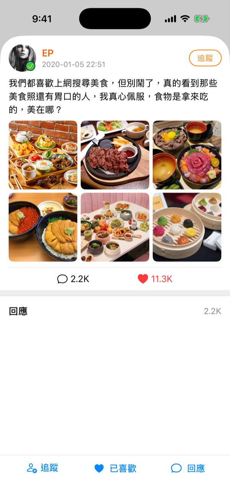
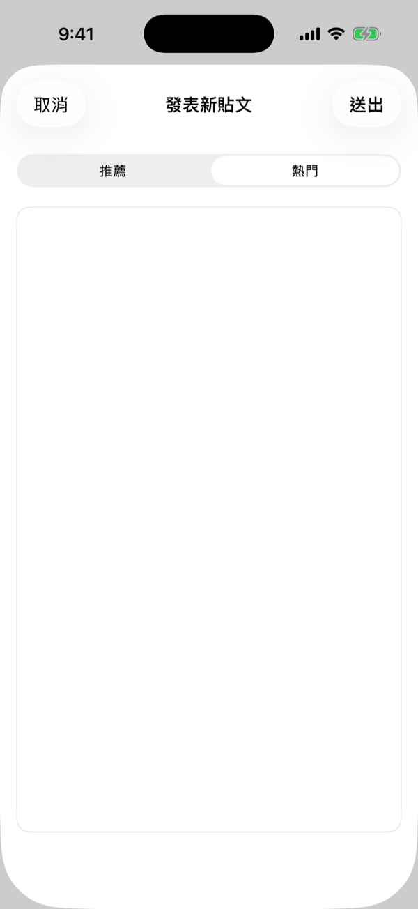

# tweetTweet

`tweetTweet` 是一個以 SwiftUI 實作的社群動態 App 原型,提供推薦與熱門兩種貼文情境,展示動態流、貼文詳情、發文與搜尋畫面。

## 截圖

<p>
  
  
  
  
  
</p>

從左到右:推薦動態流 / 熱門動態流 / 貼文詳情 / 發表新貼文 / 選擇圖片。

## 專案簡介

啟動後進入首頁,使用者可以在分頁之間切換,快速查看不同資料來源下的 UI 呈現。

目前支援兩種展示分頁:

- 推薦動態
- 熱門動態

## 主要功能

- 推薦 / 熱門雙分頁動態流
- 動態列表與貼文卡片
- 貼文詳情頁與留言互動
- 追蹤、喜歡、回應等本地狀態更新
- 貼文內容即時搜尋
- 發文流程與圖片選擇
- 列表到底狀態提示
- 自訂導覽列與外觀元件

## 技術內容

- Swift 5
- SwiftUI(視圖層 100% SwiftUI)
- UIKit + `UIHostingController`(只負責 Scene bootstrap,把 SwiftUI 視圖掛進 `UIWindow`)
- Shared App State 模式:`UserData` 為 `ObservableObject`,透過 `@EnvironmentObject` 注入所有 View
- Repository pattern:資料來源以 `PostRepository` protocol 抽象,目前實作為 `LocalPostRepository`,未來可加 `RemotePostRepository` 而不動 UI
- 自訂 View、Navigation Bar、Toolbar Button、Image Cell

## 資料來源

專案使用本地 JSON 作為展示資料:

- `Resources/PostListData_recommend_1.json`
- `Resources/PostListData_hot_1.json`

圖片與頭像素材放在 `Resources/` 底下,build 時打包進 App bundle。

## 專案結構

```
tweetTweet/
├── Controller/
│   ├── Main/                  # 首頁、分頁、搜尋、貼文詳情、發文
│   └── Scenario/              # App 啟動與 Scene 設定
├── Model/                     # 資料結構(`Post`、`PostList`)
├── Network/                   # `PostRepository` protocol + `LocalPostRepository`
├── View/
│   ├── Customised/            # 共用 SwiftUI 元件
│   └── TableViewCell/         # 可重複使用的貼文卡片
├── ViewModel/                 # Shared App State(`UserData`)與輔助狀態(`KeyboardResponder`)
└── Resources/                 # 本地 JSON 與圖片素材
```

注意:`Controller/Main/` 裡的檔案實際上是 SwiftUI View,不是 `UIViewController`。命名沿用 UIKit 時期的分層習慣,但實作以 SwiftUI 為主。

## Clone 後設定

這個 repo 內附 pre-commit hook(`.githooks/pre-commit`),用來在 commit 前掃 staged 內容,擋住 Team ID、私鑰、token 等敏感字串。Clone 下來後啟用一次:

```
git config core.hooksPath .githooks
```

需要繞過時可用 `git commit --no-verify`。

如需擴充偵測規則(例如加上自己的工作 email),可參考 `.githooks/patterns.local.example` 建立本機專用的 `.githooks/patterns.local`(已被 `.gitignore` 排除,不會 commit)。

## 執行環境

- Xcode 16 或以上
- iOS 15.0 或以上
- Swift 5

## 如何執行

1. 開啟 `tweetTweet.xcodeproj`
2. 選擇 iOS Simulator
3. 執行 `tweetTweet` scheme

建議使用較新的 iPhone Simulator,例如 iPhone 16 Pro / iPhone 17 Pro Max(需對應的 Xcode 版本)。

## 備註

此專案主要作為 UI 與資料狀態展示用途,並非完整社群服務 App。架構與接 API 的擴充方式請見「技術內容」段。

## 授權與隱私

- 程式碼採用 [MIT License](LICENSE)。
- 本 App 不收集任何使用者資料,詳見 [PRIVACY.md](PRIVACY.md)。
- `Resources/` 內的部分圖片素材僅作為展示用途,版權仍屬原作者所有,未經授權請勿轉用。
