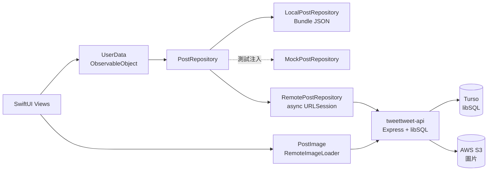

# tweetTweet

[](https://github.com/cowton0627/tweetTweet/actions/workflows/ios-ci.yml)

一個 SwiftUI 社群動態 App，以及它自己的後端。可以註冊、登入，貼文掛在自己名下，按讚、追蹤與回文都寫回伺服器，而且同一則貼文對不同帳號顯示不同狀態。

後端是 [tweettweet-api](https://github.com/cowton0627/tweettweet-api)（Express + TypeScript + libSQL），已部署於 https://tweettweet-api.onrender.com ——API 在 Render、資料在 Turso、圖片在 AWS S3，三個免費方案組起來，不依賴任何一台自己的機器保持開機。

**沒有後端也跑得起來。** 不設定任何位址時 App 讀取內建 JSON，clone 之後 `Command-R` 就能完整操作：不需要帳號、API key，也不需要起伺服器。這不是退化模式，而是這個專案的資料層設計刻意兌現的結果。

<p>
  
  
  
</p>

## 一眼看懂

| 項目 | 內容 |
| --- | --- |
| 平台 | iOS 15+ |
| UI | SwiftUI |
| 狀態管理 | `ObservableObject` + `@EnvironmentObject` |
| 資料層 | Repository pattern + dependency injection |
| 後端 | Express + TypeScript + libSQL（[另一個 repo](https://github.com/cowton0627/tweettweet-api)） |
| 部署 | Render（API）／ Turso（資料）／ AWS S3（圖片），全部免費方案 |
| 認證 | scrypt 密碼雜湊 + HS256 JWT，token 存 Keychain |
| 展示資料 | Bundle JSON + 原創生成素材（可切換為後端 API） |
| 測試 | 63 個 XCTest + 186 個後端測試，全部通過 |
| CI | GitHub Actions：main push／PR 自動 build & test |
| 已驗證環境 | iPhone 15 Simulator / iOS 17.5 |

## 主要功能

- 註冊、登入、登出；token 存在 Keychain，重開 App 仍在登入狀態
- 推薦／熱門雙分頁動態流，零圖、單圖與多圖貼文版型
- 發文掛在自己名下（未登入仍可發，會歸到 demo 帳號）
- 按讚與追蹤寫回伺服器，**同一則貼文對不同帳號顯示不同狀態**
- 回文：詳情頁列表、底部固定輸入列、往回翻頁、刪除自己的回文；每則貼文在列表上帶最新兩則
- 個人頁：帳號資訊、貼文數／追蹤者／追蹤中、追蹤按鈕、該帳號的所有貼文
- 貼文內容即時搜尋
- 相簿選圖與相機拍攝，圖片以內容雜湊命名並在伺服器去重
- VoiceOver 語意標籤、選取狀態與圖片群組描述
- 自動跟隨系統淺色／深色外觀
- 內容文字支援 Dynamic Type，並以最大輔助字級驗證

## 工程亮點

### 可替換的資料來源

`UserData` 不直接讀取 JSON，而是依賴 `PostRepository` protocol：正式 App 依設定注入本地或遠端實作，測試則注入 mock repository。

這個切分讓 UI 與資料來源解耦，而且被兌現過兩次，方向相反：

**第一次是不改。** 接上後端時 `Post`、`PostList` 與 decoder 一行都沒動——做到這件事的是讓後端去對齊既有的 JSON 契約，而不是讓 App 遷就後端。

**第二次是改，而且是故意的。** 加帳號時作者從貼文上的 `avatar`／`name` 兩個欄位變成巢狀的 `author` 物件，這是破壞性變更。既然要破壞就一次改到位，兩邊一起改、一起發。分不清「不想改」與「不能改」的架構，只是把成本延後而已。


```mermaid
flowchart LR
    View["SwiftUI Views"] --> State["UserData<br/>ObservableObject"]
    State --> Contract["PostRepository"]
    Contract --> Local["LocalPostRepository<br/>Bundle JSON"]
    Contract -. 測試注入 .-> Mock["MockPostRepository"]
    Contract --> Remote["RemotePostRepository<br/>async URLSession"]
    Remote --> API["tweettweet-api<br/>Express + libSQL"]
    View --> Images["PostImage<br/>RemoteImageLoader"]
    Images --> API
    API --> Turso[("Turso<br/>libSQL")]
    API --> S3[("AWS S3<br/>圖片")]
```

實際選哪一個由 `SceneDelegate` 決定：設定了後端位址就注入 `RemotePostRepository`，否則退回 `LocalPostRepository`。這個判斷刻意不放在 `UserData` 的預設參數裡——那樣會讓每個 SwiftUI preview 都去打網路。

功能長出來之後，這個 protocol 沒有變成一個什麼都做的大介面，而是裂成幾個各自可為 nil 的能力：`PostRepository`（讀）、`PostComposer`（發文）、`PostInteractions`（讚／追蹤）、`CommentService`、`ProfileService`。沒有後端時後四個都是 nil，畫面因此知道要隱藏對應的控制項，而不是等到有人按下去才丟例外。

### 單一共享狀態，但不是什麼都塞進去

`UserData` 由 Scene 層建立，再透過 `@EnvironmentObject` 注入 View hierarchy。列表、詳情與發文流程因此讀寫同一份貼文狀態：

- 在詳情頁按讚後，返回列表仍保持一致
- 同一 ID 同時出現在推薦與熱門列表時，更新會同步套用
- 追蹤一個人時，他在兩個列表裡的每一則貼文都會一起改——追蹤的是人，不是貼文
- 插入新貼文後會重建 ID index，保持後續查找正確

反過來，**一串回文與一個人的個人頁不放進去**。它們只在你正在看的時候有意義，放進共用狀態就要決定什麼時候把它們丟掉，而那個決定沒有好答案。所以 `CommentThread` 與 `ProfileStore` 是各自畫面的 `@StateObject`，離開畫面就結束。

### 樂觀更新，以及它的另一半

按讚要先變色再送請求，不然在慢速網路上整個 App 會像壞掉。但只更新不對帳就是在騙人，所以每個互動都成對出現：先改畫面、送出請求、失敗時放回去並把錯誤丟給使用者。

兩個容易被忽略的細節都寫進測試裡：

- **伺服器回傳的計數優先於本地推算。** 別人也在按同一則貼文，你按完的數字不一定是按之前加一。
- **回捲要回到原本的位置。** 刪除一則回文失敗時，它要回到列表中間原來那格，不是被 append 到最後。

### 有目的的測試

測試集中在容易回歸、且能證明架構價值的行為，而不是為了追求表面覆蓋率。

iOS（63 個）：

- Repository dependency injection、列表查找與跨分頁同步更新
- 新貼文插入與索引重建、跨列表產生下一個貼文 ID
- 正式 JSON fixture 解碼，以及**缺少 `recentComments` 欄位時仍能解碼**（內建 JSON 比這個功能早存在）
- loading、empty、error 與單一分頁 retry 狀態
- 網路與 HTTP 失敗的使用者訊息（依原因分類，不外洩框架的英文描述）
- 圖片載入的記憶體快取、同 URL 併發請求去重，以及失敗不被當成結果快取
- 發文流程：只上傳伺服器沒有的圖片、失敗時不留下只存在本機的貼文、手寫 multipart body 的格式
- 互動：樂觀更新、失敗回捲、追蹤套用到該作者的每一則貼文、feed 請求確實帶上 token
- 回文：分頁往回翻並前置插入、送出失敗時不清掉使用者打的字、刪除回捲到原本的位置

後端（186 個）：

- 密碼雜湊，包含**壞掉的雜湊記錄不得驗證通過**（見下一節）
- 端點的可重複呼叫性：連按兩次讚只加一，重送一次請求也只加一
- 計數快取與關聯表的一致性（`like_count`、`comment_count` 逐筆比對）
- 每個讀者看到自己的 `isLiked`／`isFollowed`，匿名讀者兩者皆否但仍讀得到內容
- Migration：建一個舊版資料庫、塞進舊格式的資料、遷移後驗證欄位搬對了，而且 `post_images` 沒被連帶刪掉

CI 在 main push 與 PR 上跑同一組。

## 兩個實際解決的問題

### `is_liked` 這個欄位假設全世界只有一個人在看

加帳號之前，`posts` 表上有 `is_liked` 與 `is_followed` 兩個欄位。這在當時不是錯的，只是把「唯一那個讀者」的狀態存進了貼文本身。

有了帳號之後同一則貼文對不同人不一樣，所以它們根本不是貼文的屬性，而是**讀者與貼文之間的關係**。改成 `likes` 與 `follows` 兩張關聯表，查詢時依 viewer 用 `EXISTS` 算出來；未登入時 viewer 是 null，兩者皆為 false——不是錯誤，是「你還沒按過任何東西」。

搬移過程有個限制值得記：託管的 libSQL 不允許關掉外鍵檢查，而 SQLite 改欄位的標準做法「建新表→複製→DROP→RENAME」會讓 `DROP TABLE posts` **連帶刪光 `post_images` 的每一列**。所以改用 `ALTER TABLE ADD/DROP COLUMN`，並在寫 migration 之前先在真的 Turso 上驗證子表不受影響。這個限制寫進了 `db.ts` 的註解，因為下一個要改 `posts` 的人會直覺地伸手去拿重建法。

### 一筆壞掉的密碼雜湊會讓任何密碼都通過

密碼用 scrypt，強度參數連同 salt 一起寫進字串：`scrypt$N$r$p$salt$hash`。這個格式差點變成漏洞——一筆壞掉的記錄 `scrypt$$$` 解析後 N/r/p 都是 0、salt 與 expected 都是空 buffer，而**比較兩個空 buffer 會成功**，於是任何密碼都能登入。

是測試抓到的，不是 code review。現在解析後強制檢查每個欄位都夠實在（N ≥ 2¹⁰、salt ≥ 8 bytes、hash ≥ 32 bytes），不滿足就直接拒絕。教訓是驗證函式的**失敗路徑要當成主要路徑來測**，而不是只測「正確密碼過、錯誤密碼不過」。

其他取捨——包括手刻 `.pbxproj` 漏掉 Resources Build Phase、Turso embedded replica 不支援交易而換掉整個 driver、精簡 Docker image 沒有 CA 憑證——都記錄在 [`DECISIONS.md`](DECISIONS.md)。

## 架構與目錄

```text
tweetTweet/
├── Controller/
│   ├── Main/                  # SwiftUI 功能畫面（含登入、個人頁、貼文詳情）
│   └── Scenario/              # App / Scene bootstrap，也是唯一決定要不要打網路的地方
├── Config/                    # xcconfig：簽章與後端位址
├── Model/                     # Post、Author、Comment
├── Network/                   # 各項能力的 protocol、本地／遠端實作、Keychain
├── View/
│   ├── Customised/            # 共用 SwiftUI 元件（含回文列表與輸入列）
│   └── TableViewCell/         # 貼文卡片
├── ViewModel/                 # 共用狀態（UserData、AuthStore）與畫面自有狀態
├── tweetTweetTests/           # Unit tests 與各項 spy／mock
└── Resources/                 # JSON、虛構頭像與貼文圖片
```

`Controller/Main/` 裡實際放的是 SwiftUI View，而非 `UIViewController`。這是專案從 UIKit 命名習慣演進而來的歷史痕跡，也列在後續整理項目中。

## 如何執行

需求：

- Xcode 16+
- iOS 15+ Simulator
- Swift 5

步驟：

1. Clone repository。
2. 開啟 `tweetTweet.xcodeproj`。
3. 選擇 `tweetTweet` scheme 與任一 iPhone Simulator。
4. 按 `Command-R`。

專案沒有第三方 dependency，也不需要建立帳號、設定 API key 或啟動後端。

### 可選：改由後端供應動態牆

預設不指向任何後端。要接上 [tweettweet-api](https://github.com/cowton0627/tweettweet-api)：

```sh
cp Config/API.local.xcconfig.example Config/API.local.xcconfig
```

檔案裡已經寫好本機後端的位址（`http` / `localhost:3000`），改成自己的即可。這個檔案被 `.gitignore` 排除，因為每個人的後端位址不同。

後端側：

```sh
npm ci && npm run seed && npm run dev
```

重新 build App 後，動態牆改由 API 供應，登入、按讚、追蹤與回文也一併啟用——這些功能在沒有後端時會自己隱藏，因為沒有伺服器就沒有帳號可以屬於。

要接已經部署好的那一個而不是本機，把 host 改成 `tweettweet-api.onrender.com`、scheme 改成 `https` 即可。

位址拆成 scheme 與 host 兩個變數，是因為 **xcconfig 把 `//` 當成註解起始**——寫成 `http://localhost:3000` 會被靜默截斷成 `http:`。

## 如何執行測試

在 Xcode 選擇 `tweetTweet` scheme 後按 `Command-U`。Shared scheme 已包含 `tweetTweetTests`，不需額外設定 test plan。

GitHub Actions 也會在 main branch push、針對 main 的 Pull Request，以及手動觸發時，使用乾淨的 macOS runner 執行相同的 build 與測試。Workflow 設有 20 分鐘 timeout、唯讀 repository 權限與 concurrency cancellation。

## 3 分鐘 Demo 路線

> **先叫醒後端。** Render 免費方案閒置 15 分鐘會休眠，冷啟動約一分鐘。開始前先在瀏覽器打一次
> <https://tweettweet-api.onrender.com/health>，看到 `{"status":"ok"}` 再繼續，否則第一個畫面會空著一分鐘。

1. 未登入直接瀏覽推薦／熱門，展示不同資料集與複合圖片版型——**不用帳號也讀得到**。
2. 到「個人」分頁註冊一個帳號。
3. 回到動態流按讚、追蹤，進貼文詳情回一則文；回文會出現在列表上那則貼文的下方。
4. 登出再看同一則貼文：讚是空的、追蹤按鈕回來了，但按讚數沒有變——**狀態是你的，計數是大家的**。
5. 點任何一個作者的名字開啟他的個人頁，看他的所有貼文與追蹤按鈕。
6. 發一則帶照片的貼文，看它掛在自己名下出現在最上面。
7. 回到程式碼，從 `PostRepository` 那一組 protocol 與 `SceneDelegate` 的注入說明資料層設計。
8. 執行兩邊的測試（`Command-U` 與 `npm test`）。

## 已知限制與下一步

這是一個作品集專案，不是營運中的社群服務。已知還缺的：

- **後端會睡著。** Render 免費方案閒置 15 分鐘後休眠，下一個請求要等約一分鐘冷啟動。
- **上傳前沒有降取樣。** 相簿原圖經 JPEG 編碼後實測 2.8 MB，而顯示寬度最多就是螢幕寬；行動網路下差別明顯。
- **沒有離線佇列。** 沒設定後端時發文只留在記憶體。
- **沒有通知。** 分頁在那裡但只有空狀態；站內通知需要另一份設計。
- **沒有找回密碼。** 註冊不收 email——這個 demo 沒有寄信的基礎設施，收了只是多存一份個資。
- **回文分頁只往回翻。** 讀取期間別人新增的回文不會自動出現，要重新進入畫面。
- `Controller/` 命名仍保留早期 UIKit 專案痕跡。

下一步：

1. 上傳前先降取樣
2. 站內通知（需要另一份設計）
3. 完成實機 VoiceOver 操作驗證
4. 補齊登入後與回文串的流程截圖或操作影片

功能的規劃與實作紀錄在 [`docs/PRODUCT_PLAN.md`](docs/PRODUCT_PLAN.md)（Phase 1–5 已完成，
每個階段都附上「實際與規劃的差異」）；完成項目與待辦在
[`docs/PROJECT_STATUS.md`](docs/PROJECT_STATUS.md)；架構取捨與踩過的坑在
[`DECISIONS.md`](DECISIONS.md)。

Accessibility 的 Simulator 驗證結果與實體裝置測試清單記錄在
[`docs/ACCESSIBILITY_VALIDATION.md`](docs/ACCESSIBILITY_VALIDATION.md)。

另有一份尚在探索、供後端研究使用的
[`Private Family Network 產品與架構 Brief`](docs/PRIVATE_FAMILY_NETWORK_BRIEF.md)。
它討論家庭私密分群、BYOS 儲存、權限模型與 MVP；目前不是本專案已承諾的功能範圍。

## 展示素材、隱私與授權

- 展示照片與虛構人物頭像皆為本專案以生成式工具製作的原創素材，不使用真實名人、第三方品牌或受版權保護角色。
- App 不收集使用者資料，詳見 [`PRIVACY.md`](PRIVACY.md)。
- 程式碼採用 [`MIT License`](LICENSE)。

## Clone 後的可選設定

Repository 內附 pre-commit hook，可檢查 staged 內容中的 Team ID、私鑰、token 與自訂敏感字串：

```sh
git config core.hooksPath .githooks
```

如需加入自己的偵測規則，可由 `.githooks/patterns.local.example` 建立本機專用的 `.githooks/patterns.local`；此檔已被 `.gitignore` 排除。
