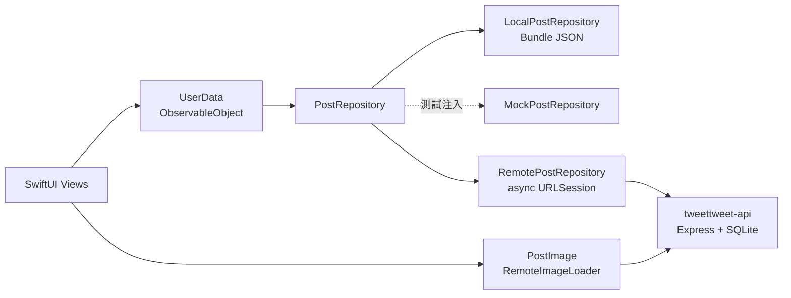

# tweetTweet

[](https://github.com/cowton0627/tweetTweet/actions/workflows/ios-ci.yml)

一個以 SwiftUI 打造的社群動態 App 原型，重點不是重製既有社群產品，而是展示複合貼文版型、跨畫面共享狀態，以及可替換資料來源的 iOS 架構。

專案採 local-first 設計：不需帳號、API key 或後端服務，clone 後即可在 Simulator 完整操作，適合作為可重現的 iOS 作品集案例。

同時它也可以接上真正的後端。加一個本機設定檔，動態牆與圖片就改由 [tweettweet-api](https://github.com/cowton0627/tweettweet-api) 供應——已部署於 https://tweettweet-api.onrender.com （API 在 Render、資料在 Turso、圖片在 S3）。App 的 model 與 decoder 完全不用改；沒設定時自動退回內建 JSON，離線仍可完整操作。

<p>
  
  
  
</p>

## 一眼看懂

| 項目 | 內容 |
| --- | --- |
| 平台 | iOS 15+ |
| UI | SwiftUI |
| 狀態管理 | `ObservableObject` + `@EnvironmentObject` |
| 資料層 | Repository pattern + dependency injection |
| 展示資料 | Bundle JSON + 原創生成素材（可切換為後端 API） |
| 測試 | 39 個 XCTest，全部通過 |
| CI | GitHub Actions：main push／PR 自動 build & test |
| 已驗證環境 | iPhone 15 Simulator / iOS 17.5 |

## 主要功能

- 推薦／熱門雙分頁動態流
- 零圖、單圖與多圖貼文版型
- 貼文詳情與留言輸入
- 喜歡、追蹤與回應等本地狀態更新
- 貼文內容即時搜尋
- 發文、相簿選圖與相機拍攝流程
- 自訂導覽列、工具列按鈕與貼文元件
- VoiceOver 語意標籤、選取狀態與圖片群組描述
- 自動跟隨系統淺色／深色外觀
- 內容文字支援 Dynamic Type，並以最大輔助字級驗證

## 工程亮點

### 可替換的資料來源

`UserData` 不直接讀取 JSON，而是依賴 `PostRepository` protocol：正式 App 依設定注入本地或遠端實作，測試則注入 mock repository。

這個切分讓 UI 與資料來源解耦，而且已經被實際兌現——接上後端時，`Post`、`PostList` 與 `RemotePostRepository` 一行都沒有改。做到這件事的是讓後端去對齊既有的 JSON 契約，而不是讓 App 遷就後端。


```mermaid
flowchart LR
    View["SwiftUI Views"] --> State["UserData<br/>ObservableObject"]
    State --> Contract["PostRepository"]
    Contract --> Local["LocalPostRepository<br/>Bundle JSON"]
    Contract -. 測試注入 .-> Mock["MockPostRepository"]
    Contract --> Remote["RemotePostRepository<br/>async URLSession"]
    Remote --> API["tweettweet-api<br/>Express + SQLite"]
    View --> Images["PostImage<br/>RemoteImageLoader"]
    Images --> API
```

實際選哪一個由 `SceneDelegate` 決定：設定了後端位址就注入 `RemotePostRepository`，否則退回 `LocalPostRepository`。這個判斷刻意不放在 `UserData` 的預設參數裡——那樣會讓每個 SwiftUI preview 都去打網路。

### 單一共享狀態

`UserData` 由 Scene 層建立，再透過 `@EnvironmentObject` 注入 View hierarchy。列表、詳情與發文流程因此讀寫同一份貼文狀態：

- 在詳情頁按讚後，返回列表仍保持一致
- 同一 ID 同時出現在推薦與熱門列表時，更新會同步套用
- 插入新貼文後會重建 ID index，保持後續查找正確

### 有目的的測試

測試集中在容易回歸、且能證明架構價值的行為，而不是為了追求表面覆蓋率：

- Repository dependency injection
- 推薦／熱門列表查找與同步更新
- 新貼文插入與索引重建
- 跨列表產生下一個貼文 ID
- 圖片庫去重與順序
- 正式推薦／熱門 JSON fixture 解碼
- loading、empty、error 與單一分頁 retry 狀態
- 遠端成功回應、JSON decoding 與 HTTP error
- 後端位址的組裝、空值處理與未設定時的 fallback
- 網路與 HTTP 失敗的使用者訊息（依原因分類，不外洩框架的英文描述）
- 圖片載入的記憶體快取、同 URL 併發請求去重，以及失敗不被當成結果快取
- 發文流程：只上傳伺服器沒有的圖片、失敗時不留下只存在本機的貼文、手寫 multipart body 的格式

目前結果：**39 passed、0 failed、0 skipped**。

## 一個實際解決的技術問題

這個專案的 `.pbxproj` 是手刻的最小設定。早期雖然 `Assets.xcassets` 與 `LaunchScreen.storyboard` 已出現在 Xcode navigator，卻沒有真正加入 Resources Build Phase，造成：

- App 上下出現舊尺寸 fallback 的黑邊
- App Icon 更新後仍不顯示
- Asset catalog 沒有被 `actool` 正確處理

修正方式不是重建整個 project，而是補齊 file reference、build file、group 與 build phase，並設定 `ASSETCATALOG_COMPILER_APPICON_NAME = AppIcon`。最後以 build 產物中的 `CFBundleIcons` 與 `Assets.car` 驗證，而不只看 Xcode UI。

完整背景與其他取捨記錄在 [`DECISIONS.md`](DECISIONS.md)。

## 架構與目錄

```text
tweetTweet/
├── Controller/
│   ├── Main/                  # SwiftUI 功能畫面
│   └── Scenario/              # App / Scene bootstrap
├── Config/                    # xcconfig：簽章與後端位址
├── Model/                     # Post、PostList
├── Network/                   # Repository protocol、本地／遠端實作與設定
├── View/
│   ├── Customised/            # 共用 SwiftUI 元件
│   └── TableViewCell/         # 貼文卡片
├── ViewModel/                 # Shared state 與輔助狀態
├── tweetTweetTests/           # Unit tests 與 mock repository
└── Resources/                 # JSON、虛構頭像與貼文圖片
```

`Controller/Main/` 裡實際放的是 SwiftUI View，而非 `UIViewController`。這是專案從 UIKit 命名習慣演進而來的歷史痕跡，也列在後續整理項目中。

## 如何執行

需求：

- Xcode 16+
- iOS 15+ Simulator
- Swift 5

步驟：

1. Clone repository。
2. 開啟 `tweetTweet.xcodeproj`。
3. 選擇 `tweetTweet` scheme 與任一 iPhone Simulator。
4. 按 `Command-R`。

專案沒有第三方 dependency，也不需要建立帳號、設定 API key 或啟動後端。

### 可選：改由後端供應動態牆

預設不指向任何後端。要接上 [tweettweet-api](https://github.com/cowton0627/tweettweet-api)：

```sh
cp Config/API.local.xcconfig.example Config/API.local.xcconfig
```

檔案裡已經寫好本機後端的位址（`http` / `localhost:3000`），改成自己的即可。這個檔案被 `.gitignore` 排除，因為每個人的後端位址不同。

後端側：

```sh
npm ci && npm run seed && npm run dev
```

重新 build App 後，動態牆就改由 API 供應。沒有這個設定檔時 App 一切照舊，讀取內建 JSON。

位址拆成 scheme 與 host 兩個變數，是因為 **xcconfig 把 `//` 當成註解起始**——寫成 `http://localhost:3000` 會被靜默截斷成 `http:`。

## 如何執行測試

在 Xcode 選擇 `tweetTweet` scheme 後按 `Command-U`。Shared scheme 已包含 `tweetTweetTests`，不需額外設定 test plan。

GitHub Actions 也會在 main branch push、針對 main 的 Pull Request，以及手動觸發時，使用乾淨的 macOS runner 執行相同的 build 與測試。Workflow 設有 20 分鐘 timeout、唯讀 repository 權限與 concurrency cancellation。

## 3 分鐘 Demo 路線

1. 在推薦／熱門間切換，展示不同資料集與複合圖片版型。
2. 進入貼文詳情按讚或追蹤，再返回列表確認共享狀態。
3. 使用搜尋快速過濾貼文內容。
4. 進入發文流程並選擇圖片。
5. 回到程式碼，從 `PostRepository`、`LocalPostRepository` 與 `UserData` 說明 dependency injection。
6. 執行測試，展示 mock repository 與正式 JSON fixture 都受到驗證。
7. 起後端、直接改一筆 SQLite 資料再重啟 App，證明畫面內容真的來自 API。
8. 拍一張照片發文，回到列表看它出現在最上面——那則貼文與那張圖現在都在伺服器上。

## 已知限制與下一步

這是一個 UI 與狀態架構原型，不是完整社群服務：

- 沒有登入；讚與追蹤仍是本地狀態，重開即失
- 沒有本地持久化與離線佇列：沒有網路時發文只留在記憶體
- 搜尋與貼文互動（讚、追蹤）仍是本地行為
- `Controller/` 命名仍保留早期 UIKit 專案痕跡

下一階段規劃：

1. 讚與追蹤寫回後端
2. 上傳前先降取樣（相簿原圖經 JPEG 編碼後實測 2.8 MB，而顯示寬度最多就是螢幕寬）
3. 完成實機 VoiceOver 操作驗證
4. 補齊全新素材版本的流程截圖或操作影片

另有一份尚在探索、供後端研究使用的
[`Private Family Network 產品與架構 Brief`](docs/PRIVATE_FAMILY_NETWORK_BRIEF.md)。
它討論家庭私密分群、BYOS 儲存、權限模型與 MVP；目前不是本專案已承諾的功能範圍。

Accessibility 的 Simulator 驗證結果與實體裝置測試清單記錄在
[`docs/ACCESSIBILITY_VALIDATION.md`](docs/ACCESSIBILITY_VALIDATION.md)。

目前的完成項目、待辦事項與續作順序記錄在
[`docs/PROJECT_STATUS.md`](docs/PROJECT_STATUS.md)。

## 展示素材、隱私與授權

- 展示照片與虛構人物頭像皆為本專案以生成式工具製作的原創素材，不使用真實名人、第三方品牌或受版權保護角色。
- App 不收集使用者資料，詳見 [`PRIVACY.md`](PRIVACY.md)。
- 程式碼採用 [`MIT License`](LICENSE)。

## Clone 後的可選設定

Repository 內附 pre-commit hook，可檢查 staged 內容中的 Team ID、私鑰、token 與自訂敏感字串：

```sh
git config core.hooksPath .githooks
```

如需加入自己的偵測規則，可由 `.githooks/patterns.local.example` 建立本機專用的 `.githooks/patterns.local`；此檔已被 `.gitignore` 排除。
